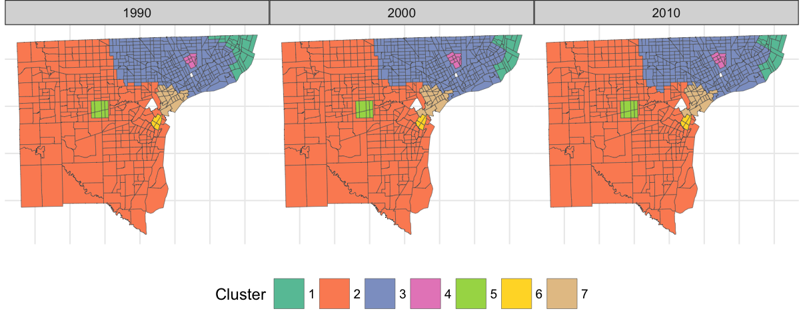

How are people with different identities and characteristics distributed in space? As demographic data become more detailed and accessible, there has been a proliferation of methods for processing that data to learn about this fundamental question. Many studies in this area pose one of the following two main problems: 

1. **Segregation quantification**. Segregation quantification methodologies tend to focus on questions of degree. *How* segregated is this space? Does the answer vary across scales? Can we quantify a sense in which some subregions are more segregated than others? Segregation quantification studies tend to lie at the intersection of sociology and geography.[^2]
2. **Regionalization**. Regionalization methodologies focus on questions of structure. What is the simple structure underlying a given demographic distribution? Most regionalization methods treat this problem as an optimization or machine-learning problem, in which we seek to create regions that are relatively homogeneous internally but quite different from each other. 

Package `compx` proceeds from two propositions: 

1. Segregation quantification and regionalization are deeply linked. 
2. The link between them is most usefully expressed in terms of *information theory*.

These propositions suggest that we seek information-theoretic regionalization methodologies, and that we use these methodologies to study the *structure of spatial segregation.* `compx` is therefore a contribution to a body of more recent work[^3] in the segregation studies literature focusing on how demographic characteristics and segregation measures depend on space and scale. 

# Introducing compx

`compx` is an `R` package for analyzing and visualizing spatial segregation using contemporary mathematics and machine learning. The theoretical core of `compx` is *information geometry*[^1], a relatively young branch of mathematics that uses the classical tools of differential geometry to learn about probabilistic and statistical models. Our core approach is to treat a map with demographics as a parameterized statistical model, and then use elementary tools of information geometry to learn about it. This approach enables the following two forms of analysis. 

## Studying Spatial Complexity
How complex are the patterns of segregation in different cities? Where are the spatial "boundaries" between demographic groups? Package `compx` provides mathematical methods for approaching these questions through the unifying idea of the metric tensor. The components of the metric tensor are large precisely at spatial boundaries between demographic groups, as illustrated in Detroit on the right. 

Learn more about computing, analyzing, and visualizing the metric tensor [here](https://philchodrow.github.io/compx/vignette_metric.html). 

## Regionalization

Most commonly-used measures of spatial segregation have an attractive property: *additive spatial decomposability.*[^4] A segregation measure $S$ with this property can be decomposed into two terms: 

$$S = S_{within} + S_{between}\;.$$ 

In this expression, $S_{within}$ quantifies how much segregation lies within regions, and $S_{between}$ how much between. This property enables a powerful form of analysis, in which we study "how much" segregation resides at each level of spatial aggregation. However, there's a problem -- common administrative regions like tracts, counties, and city boundaries are arbitrary from demographic points of view, and using them as units of spatial aggregation may lead to misleading results. This problem -- a manifestation of the Modifiable Areal Unit Problem -- has led to many contemporary papers to disregard decomposition analysis, despite the fact that the possibility of such analysis is a fundamental motivation of the formulations of many core measures. 

Taking a cue from our core propositions above, `compx` aims to rehabilitate decomposition analysis by finding non-arbitrary scales of spatial aggregation through novel regionalization algorithms. The core idea is to consider [*geodesic distances*](https://en.wikipedia.org/wiki/Geodesic) between spatial locales, and use this distance a a graph weighting. Appropriate geometrical choices allow these geodesic distances to quantify approximate information loss associated with regionalization, which loss can then be used to guide novel regionalization methods for finding demographic boundaries in both space and time: 

These non-arbitrary boundaries can then be used for spatial decomposition studies. The boundaries we find are related to the components of the metric tensor visualized above -- areas with large components tend to be precisely those that lie on regional boundaries, which can be observed by comparing the two visualizations.   

Learn more about constructing, analyzing, and visualizing regions [here](https://philchodrow.github.io/compx/vignette_clustering.html). 

# Questions, Help, Feedback

I'd love to hear from you! Please reach out through GitHub, or my [website](https://philchodrow.github.io/). 

[^2]: For a helpful review, see Reardon, S. F., & O’Sullivan, D. (2004). Measures of Spatial Segregation. Sociological Methodology, 34(1), 121–162.
[^1]: Amari, S.-I., & Nagaoka, H. (2007). *Methods of Information Geometry.* American Mathematical Society.
[^3]: E.g. S. Fowler, C. (2016). Segregation as a multiscalar phenomenon and its implications for neighborhood-scale research: the case of South Seattle 1990–2010. Urban Geography, 37(1), 1–25.
[^4]: Formulated by Reardon, S. F., & O’Sullivan, D. (2004).

